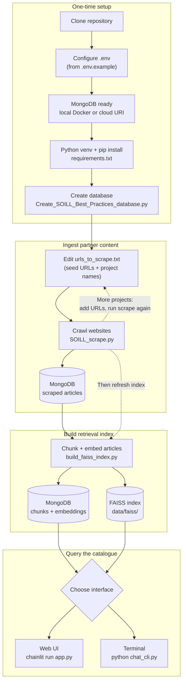

# SOILL Catalogue of Best Practices (Task T4.4)

[](https://creativecommons.org/licenses/by/4.0/)

**Author:** Prof. S. Hallett, Cranfield University
**Date:** 19/5/2026
**Licence:** [CC BY 4.0](LICENSE)

Toolkit for the [SOILL](https://www.soill2030.eu/) project (Support Structure for Soil Health Living Labs and Lighthouses). It crawls partner project websites, stores extracted articles in MongoDB, builds a FAISS retrieval index, and answers questions via a Chainlit chatbot.

**Production hosting:** the chatbot application is packaged as a **Docker image** (see [`deploy_docker/`](deploy_docker/README.md)) for deployment on platforms such as [Render.com](https://render.com). Scraping and index building stay on your machine (or CI); the container runs Chainlit against **MongoDB Atlas** (or another remote MongoDB) and the **Mistral API**.

## What it does

1. **Database setup** — Creates the MongoDB database and article collection (names from `.env`).
2. **Web scraping** — Crawls seed URLs in `urls_to_scrape.txt`, extracts HTML articles, and appends them to MongoDB.
3. **RAG index** — Chunks and embeds articles (Mistral), stores vectors in MongoDB and FAISS.
4. **Chatbot** — Retrieves relevant chunks and answers with cited sources (Chainlit UI or terminal CLI).

## How to use the system



**Full reset** (wipe articles and start over): run `Create_SOILL_Best_Practices_database.py --reset`, then scrape and `build_faiss_index.py` again. `--reset` does not delete the FAISS files until you rebuild the index.

## Project layout

| Path | Purpose |
|------|---------|
| `Create_SOILL_Best_Practices_database.py` | Create or reset the scraped-articles collection |
| `SOILL_scrape.py` | Crawl websites and save articles |
| `build_faiss_index.py` | Rebuild chunks + FAISS from all articles in MongoDB |
| `app.py` | Chainlit web UI (`chainlit run app.py`) |
| `chat_cli.py` | Terminal chat (no Chainlit; works on Python 3.14) |
| `config.py` | Loads settings from `.env` |
| `.env.example` | Template for `.env` (committed) |
| `urls_to_scrape.txt` | Seed URLs and project names (CSV) |
| `soill_chatbot/` | RAG package (chunking, embeddings, FAISS, Mistral) |
| `mongodb_docker/` | Docker Compose for local MongoDB |
| `deploy_docker/` | Docker image for the Chainlit chatbot (Render.com, etc.) — [README](deploy_docker/README.md) |
| `public/` | Logos, favicon, Chainlit welcome CSS |
| `.chainlit/` | Chainlit UI configuration |
| `webscraping-important-considerations.md` | Ethics and crawling guidelines |
| `chainlit.md` / `chainlit_en-GB.md` | Chainlit welcome screen copy |
| `LICENSE` | CC BY 4.0 licence text |

Generated locally (gitignored): `.env`, `.venv/`, `logs/`, `data/faiss/`.

## Prerequisites

- Python **3.10–3.13** for Chainlit (`app.py`); **3.14** is fine for scraping and `chat_cli.py`
- pip
- **MongoDB** — local [Docker](mongodb_docker/README.md) **or** a cloud host (e.g. [MongoDB Atlas](https://www.mongodb.com/cloud/atlas)) via `MONGO_URI`
- [Mistral API](https://console.mistral.ai/) key for embeddings and chat

## Quick start

### 1. Clone and configure

```bash
git clone <repository-url>
cd SOILL_BestPractices
cp .env.example .env
```

Edit `.env` — set `MONGO_DB`, `MISTRAL_API_KEY`, and other values. **Do not commit `.env`.**

| Variable | Description |
|----------|-------------|
| `MONGO_URI` | MongoDB connection string |
| `MONGO_DB` | Database name (e.g. `SOILL_catalogue`) |
| `MONGO_COLLECTION` | Scraped articles (e.g. `webscrape`) |
| `MONGODB_CHUNKS_COLLECTION` | RAG chunks with embeddings |
| `MONGODB_CONVERSATIONS_COLLECTION` | Chat Q&A log (e.g. `soill_conversations`) |
| `MIN_DELAY` | Minimum seconds between HTTP requests |
| `REQUEST_TIMEOUT` | HTTP timeout (seconds) |
| `MAX_PAGES_PER_SITE` | Page cap per seed (`0` = no cap) |
| `MISTRAL_API_KEY` | Mistral API key |
| `MISTRAL_CHAT_MODEL` | Chat model |
| `MISTRAL_CHAT_MODEL_FALLBACK` | Optional model if primary hits rate limits (429) |
| `RAG_TOP_K` | Chunks retrieved per question |
| `CHAT_HISTORY_ENABLED` | Multi-turn: send prior Q&A pairs to the model |
| `CHAT_HISTORY_EXPAND_RETRIEVAL` | Prepend prior questions to FAISS search on follow-ups |

See [`.env.example`](.env.example) for the full list (including multi-turn and logging).

### 2. MongoDB

Use **either** local Docker **or** a cloud connection string in `.env` — all Python scripts use `MONGO_URI` only.

**Option A — local Docker** (from the repository root):

```bash
docker compose -f mongodb_docker/docker-compose.yml --env-file .env up -d
```

Set `MONGO_URI=mongodb://127.0.0.1:27017/` (host/port must match `MONGO_HOST` / `MONGO_PORT`).  
Details: [mongodb_docker/README.md](mongodb_docker/README.md).

**Option B — cloud (e.g. MongoDB Atlas)**

1. Create a cluster and database user with **read/write** on `MONGO_DB`.
2. Allow your IP under **Network Access** (or use a suitable VPC/peering rule).
3. Set `MONGO_URI` to the Atlas connection string, for example:

   ```text
   MONGO_URI=mongodb+srv://<user>:<password>@<cluster>.mongodb.net/
   ```

4. After `pip install -r requirements.txt`, ensure **`dnspython`** is installed (included in `requirements.txt` for `mongodb+srv://`).

Restart Chainlit after changing `MONGO_URI`. Conversation logs are stored in  
`MONGO_DB` / `MONGODB_CONVERSATIONS_COLLECTION` (not in Chainlit’s own UI).

### 3. Python environment

```bash
python3.13 -m venv .venv
source .venv/bin/activate          # Windows: .\.venv\Scripts\activate
python -m pip install --upgrade pip
pip install -r requirements.txt
```

### 4. Create the database (first time only)

```bash
python Create_SOILL_Best_Practices_database.py
```

To **wipe all scraped articles** and recreate the collection:

```bash
python Create_SOILL_Best_Practices_database.py --reset
```

This does **not** remove the FAISS index or `chunks` collection; run `build_faiss_index.py` after re-scraping.

### 5. Scrape

Edit `urls_to_scrape.txt`, then:

```bash
python SOILL_scrape.py
```

Console progress and `logs/SOILL_scrape_*.log`.

### 6. Build the FAISS index

```bash
python build_faiss_index.py
```

Reads **all** articles in `MONGO_COLLECTION`, clears `MONGODB_CHUNKS_COLLECTION`, re-embeds, and replaces `data/faiss/index.faiss`. Re-run after any scrape that changes the catalogue.

### 7. Run the chatbot

**Web UI (Chainlit):**

```bash
chainlit run app.py
```

Open http://localhost:8000 (or the URL shown).

If you see `anyio.NoEventLoopError`, use Python 3.13 for the venv.

**Terminal:**

```bash
python chat_cli.py
```

Type `quit`, `exit`, or `q` to exit. The terminal CLI also keeps multi-turn history for the current run when `CHAT_HISTORY_ENABLED=true`.

Restart Chainlit after rebuilding the index or changing `MONGO_URI`.

## Deploy the chatbot with Docker (Render.com and similar)

The **whole chatbot stack** needed at runtime (`app.py`, `soill_chatbot/`, Chainlit config, FAISS rebuild logic) is built into one image from [`deploy_docker/Dockerfile`](deploy_docker/Dockerfile). That image is intended for cloud hosts that run Docker (e.g. **Render.com**), so colleagues can use a public HTTPS URL without installing Python locally.

**What stays outside the container**

| Task | Where |
|------|--------|
| Scrape partner sites | Your machine: `SOILL_scrape.py` |
| Create DB / reset articles | Your machine: `Create_SOILL_Best_Practices_database.py` |
| Chunk + embed catalogue | Your machine: `build_faiss_index.py` (against Atlas) |
| MongoDB data | [MongoDB Atlas](https://www.mongodb.com/cloud/atlas) (or other cloud MongoDB) |
| Secrets | Host environment variables (`MONGO_URI`, `MISTRAL_API_KEY`, …) — not baked into the image |

**Typical workflow**

1. Develop and ingest locally (sections above) with `MONGO_URI` pointing at Atlas.
2. Run `python build_faiss_index.py` once so Atlas has **chunks with embeddings**.
3. Build and test the image locally, then connect the same repo on Render.

**Local smoke test** (from the repository root):

```bash
docker compose -f deploy_docker/docker-compose.yml --env-file .env up --build
```

Open http://localhost:8000

**Render.com (summary)**

- **Root directory:** repository root (empty).
- **Dockerfile path:** `deploy_docker/Dockerfile`
- Set environment variables from [`.env.example`](.env.example) in the Render dashboard (Render injects `PORT` automatically).
- On each new instance, the entrypoint rebuilds `data/faiss/` from MongoDB when the index file is missing (fast if chunks already exist).

Step-by-step Render settings, optional `REBUILD_FAISS_ON_START`, and file descriptions: **[`deploy_docker/README.md`](deploy_docker/README.md)**.

**Privacy:** If you share the public URL, document IP/User-Agent logging (see [Multi-turn chat](#multi-turn-chat-and-conversation-logging)); set `LOG_CLIENT_METADATA=false` if you prefer hashes only.

## Multi-turn chat and conversation logging

The assistant can use the **last few question–answer pairs** for follow-ups (e.g. “tell me more about that”). This is normal for RAG systems: limited history controls cost, keeps retrieval focused, and reduces privacy risk.

### Chainlit (browser)

Each chat has a **Chainlit `thread_id`**. While the tab/session is open, up to `CHAT_HISTORY_TURNS` prior pairs are sent to Mistral with each new question.

| Variable | Default | Purpose |
|----------|---------|---------|
| `CHAT_HISTORY_ENABLED` | `true` | Include recent turns in the model prompt |
| `CHAT_HISTORY_TURNS` | `3` | Number of prior Q&A pairs to include (not unlimited memory) |
| `CHAT_HISTORY_MAX_ANSWER_CHARS` | `1500` | Truncate long answers in history |
| `CHAT_HISTORY_EXPAND_RETRIEVAL` | `true` | Prepend prior questions to FAISS search on follow-ups |
| `CHAT_HISTORY_RETRIEVAL_MAX_CHARS` | `2000` | Max characters in the expanded FAISS search query |
| `LOG_CONVERSATIONS` | `true` | Store each turn in MongoDB |
| `LOG_CLIENT_METADATA` | `true` | Log `client_ip` and `user_agent` (see privacy note below) |

**Example test (same chat thread):** ask `describe project cafamore`, then `which partners does that involve?` — both answers should stay on CAFAMORE with the same `thread_id` in MongoDB.

**Reloading history after refresh:** MongoDB reload on chat start only runs when **both** `CHAT_HISTORY_ENABLED=true` **and** `LOG_CONVERSATIONS=true`, and only for the **same `thread_id`**. A **new chat** or new browser session usually gets a new `thread_id`, so yesterday’s turns are not loaded.

**Not remembered across days by default:** History is capped at the last **N** turns per thread, not “everything this user ever asked”. `visitor_fingerprint` (SHA-256 of IP + User-Agent) is for **logging and analytics**, not for loading chat history.

### Terminal (`chat_cli.py`)

Multi-turn works for the **current terminal session** only (no Mongo reload between runs unless you extend the code).

### Logging fields (MongoDB)

- `thread_id` — Chainlit conversation thread
- `session_id` — Chainlit session id
- `visitor_fingerprint` — SHA-256 hash of `client_ip|user_agent`
- `client_ip`, `user_agent` — only if `LOG_CLIENT_METADATA=true`

Check the Chainlit terminal for `Failed to log conversation to MongoDB` if rows do not appear in Atlas (permissions, network access, or wrong database name).

For **follow-up** questions (e.g. “which partners does that involve?”), FAISS search uses prior user questions plus the new message when `CHAT_HISTORY_EXPAND_RETRIEVAL=true`. Otherwise retrieval uses only the latest question; chat history is still sent to the model for dialogue context.

### Troubleshooting multi-turn and logging

| Symptom | Likely cause | What to do |
|---------|----------------|------------|
| `thread_id` / `session_id` = `anonymous` in MongoDB | Old Chainlit metadata bug or context unavailable | Use current code (`get_context().session`), restart Chainlit |
| Follow-up answers wrong project | FAISS searched only the vague follow-up | Set `CHAT_HISTORY_EXPAND_RETRIEVAL=true` in `.env` |
| No rows in Atlas | Wrong DB, logging off, or insert error | Check `MONGO_DB`, `LOG_CONVERSATIONS`; terminal for `Failed to log conversation` or `Logged conversation to…` |
| History lost after refresh | New Chainlit `thread_id` | Expected; only same thread reloads from Mongo when `LOG_CONVERSATIONS=true` |

**Privacy:** If you deploy for multiple users, document IP/User-Agent logging in your privacy notice. Set `LOG_CLIENT_METADATA=false` to store only hashed `visitor_fingerprint` and thread ids.

## Adding projects without wiping the database

1. Add new lines to `urls_to_scrape.txt` (comment out seeds already scraped if you only want new sites).
2. Run `python SOILL_scrape.py` — new articles are **appended** (no `--reset`).
3. Run `python build_faiss_index.py` — re-indexes the **entire** catalogue in MongoDB.

**Note:** Re-scraping the same URL can create duplicate MongoDB documents (deduplication is per crawl run only). To refresh one project, delete its documents first:

```bash
mongosh "$MONGO_URI" --eval 'db.getSiblingDB("SOILL_catalogue").webscrape.deleteMany({ project_name: "GOV4ALL" })'
```

Adjust database and collection names to match `.env`.

## Seed URLs and crawl scope

`urls_to_scrape.txt` format: `URL,ProjectName`

```text
# Nested project page — crawl only under this path
https://www.example.org/projects/demo,DemoProject

# Domain root — crawl entire site on that host
https://partner-site.eu,PartnerSite
```

- Lines starting with `#` are comments.
- `ProjectName` is stored as `project_name` on each article.
- **Nested seeds** (e.g. `/projects/gov4all`): crawler stays on the same domain and **only under that path prefix**; it does not walk up to parent sections.
- **Domain-root seeds**: full same-domain crawl (subject to `MAX_PAGES_PER_SITE` and `robots.txt`).

## Article schema (`MONGO_COLLECTION`)

| Field | Type | Description |
|-------|------|-------------|
| `title` | string | Article heading |
| `description` | string | Body text |
| `url` | string | Article or canonical URL |
| `scrape_date` | date (UTC) | When scraped |
| `content_type` | string | Always `article` |
| `source` | string | Page URL where the block was found |
| `seed_url` | string | Seed from `urls_to_scrape.txt` |
| `project_name` | string | Label from `urls_to_scrape.txt` |
| `source_domain` | string | Hostname |
| `heading_level` | string | Optional HTML heading tag |

## How scraping works

For each seed in `urls_to_scrape.txt`, in order:

1. Start at the seed URL (breadth-first, same domain, path prefix if nested).
2. Find **articles**: `<article>` or blocks whose CSS class matches markers in `CONTENT_CLASSES` (`SOILL_scrape.py`).
3. Insert into MongoDB with delays, `robots.txt` checks, and in-run duplicate detection.

See [webscraping-important-considerations.md](webscraping-important-considerations.md).

## Logs

```bash
ls logs/
tail -f logs/SOILL_scrape_*.log
```

## Dependencies

See `requirements.txt`. Main packages: `pymongo`, `dnspython` (for `mongodb+srv://`), `requests`, `beautifulsoup4`, `chainlit`, `faiss-cpu`, `mistralai`, `numpy`.

## Licence

Source code and documentation in this repository are licensed under [Creative Commons Attribution 4.0 International](LICENSE) (CC BY 4.0).

Scraped third-party website content is **not** covered by this licence; respect each source site’s terms of use and copyright.

## References

- [SOILL project](https://www.soill2030.eu/)
- [Render — Deploy a Docker image](https://render.com/docs/docker)
- [MongoDB with Docker](https://www.mongodb.com/docs/manual/tutorial/install-mongodb-community-with-docker/)
- [Mission Soil catalogue (Zenodo)](https://zenodo.org/records/17549268)
- [Creative Commons BY 4.0](https://creativecommons.org/licenses/by/4.0/)

## Contact

SOILL@cranfield.ac.uk
